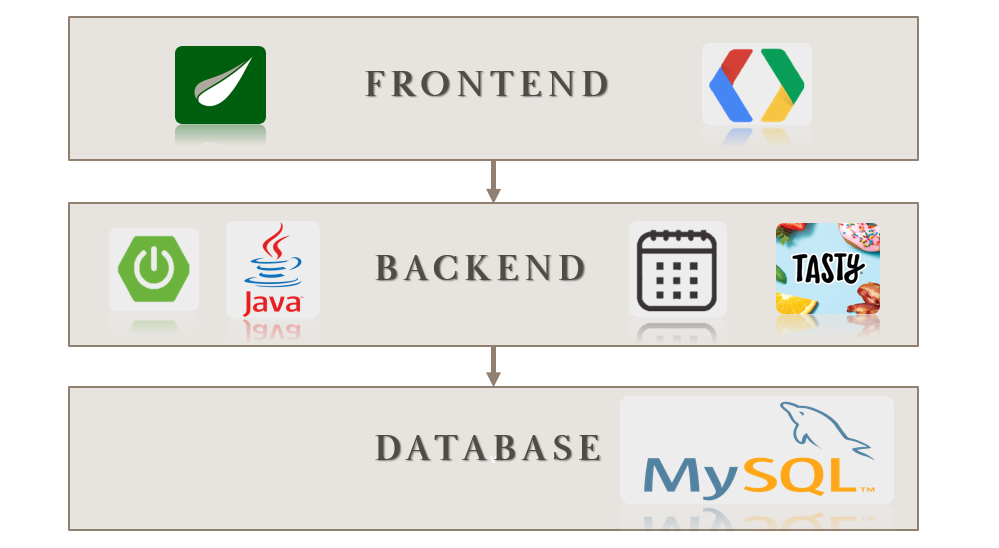

# FamilyHQ

## Project Overview
Family HQ is a family event calendar and organisation web application developed with Spring Boot, Thymeleaf and MySQL.
A user of Family HQ can have one of two roles which are parent or child. The aim of Family HQ  is to streamline family
organisation by providing the planning functions all in one place.

## Functions of Project

## Technology Stack
